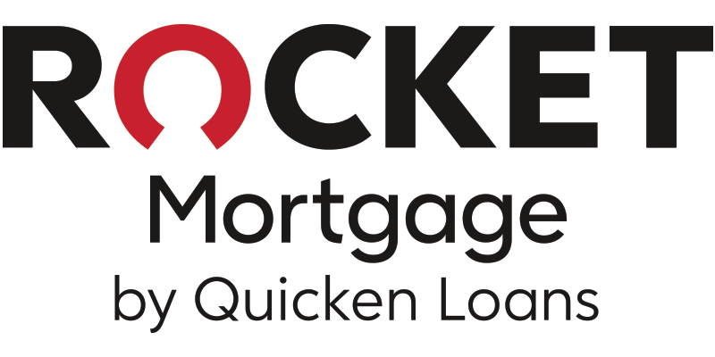

# Rocket Mortgage by Quicken Loans

---

Khulika Rojanakanoksak

---

## Overview and Origin
 Quicken Loans is a non-bank mortgage lender based in Detroit, Michigan. The company, originally Rock Financial, was found in 1985 by Dan Gilbert, Ron Berman, Lindsay Gross, and Gary Gilbert. However, online mortgage lending business started when Intuit Inc., then a maker of an online lending platform called QuickenMortgage, bought the company in 1999. Later in 2002, Dan Gilbert bought Quicken Loans back from Intuit by $ 64 million funded from himself and some private investors. 

Unlike traditional banks, Quicken Loans relies on wholesale funding and make loans over online application rather than over office branches. The business model was developed since late 1990s. This help customers out of long and complicated traditional mortgage application process with banks. Loan applications in Quicken Loans can be preapproved within 10 minutes while the process at banks can took days or weeks. Moreover, Quicken Loans was the first non-bank lender who offer mortgage loans across the country back when business was very fragmented by states from different law and regulation in mortgage and housing markets.

Leading by Jay Farner, CEO, Quicken Loans team up executives who are professionals in real estate and have vision in technology. The company is still gearing toward more efficiency in digital mortgage lending.

## Business Activities
Quicken Loans offers completely digital process for mortgage lending. The process starts from loan application to loan underwriting and processing. Digital mortgages are offered to retail borrowers who are looking for new loans or refinancing loans. With faster process and more efficiency in loan processing, this benefits refinancing loans the most. When cost of borrowing decrease, borrowers will find themselves be able to lock their loan rate faster than going to traditional bank branches. Such efficiency also benefits borrowers who wish to cash out their loans from selling the house, paying down the loan or refinancing the loan. Moreover, Quicken Loans also help customer tap benefits under government support programs, such as FHA loans, VA loans, USDA loans, and HARP refinancing, which are not provided by some other lenders 

In 2015, Quicken Loans launched “Rocket Mortgage” which is a mobile application for mortgage lending and mortgage assistance resource. The application helps customers go through mortgage application one step at a time and keep them feel comfortable and casual enough to borrow a six-figure loan. They can customize loan term to suit their financial statement. Prospect customers can also use the application to do research on their available options for the new loan or refinancing loan. 

Key technology of digital mortgage lending provided by Rocket Mortgage is the automated underwriting system (AUS) which utilize machine learning and algorithm to analyse credit profile and make decision on loan approval. With this technology, customer will be able to know the preapproval result within 8 minutes. This stage is when borrowers can lock their mortgage rate, called RateShield. It is critical in seizing the opportunity during fast drop in interest rate. 

Another key advantages that Rocket Mortgage have over other lenders are how it links all your essential financial background such as bank and investment account from almost all U.S. financial institutions. Besides, it can link employment data from majority of American companies. Moreover, the application is also user friendly. Feeds in the application will help you keep up with to-do list, e-sign documents and monitor the loan process. With appraisal waiver in place from last year, the digital mortgage lending market size could have more room to expand.  

## Landscape
Playing field in mortgage and real estate financial services could be broke down into real estate investment and mortgage lending services. Quicken Loans fall into the latter landscape together with Lending Tree, Blend, SoFi, Reali, Roostify, HouseCanary, States Title, Morty, and Spruce. Beside FinTech firms in the same league, major banks are also competing in this digital mortgage lending landscape. Faster and cheaper services are the direction that players in this field are gearing toward. Digitalization trend in mortgage lending also force banks to develop in-house online platform for mortgage application Recently, Quicken Loans jumped into a do-everything-in-getting-a-home business. Rocket Home was just launched and offer a platform for searching and buying house. Key competitor in this field would be Zillow and traditional real estates agents. 

## Results 
Even applying mortgage loan online seems uncomfortable but growing size of customers choose to go online when they are looking for loans.  Younger and male customers apply mortgage loan online more than older or female borrowers. With growing online-based customer and changing in demographic, Quicken Loans successfully took down Wells Fargo as the largest retail mortgage lender in the country since 2018.  Increase of loans closure by Quicken Loans during COVID-19 pandemic is also another evidence of Quicken Loans, better infrastructure and less bottleneck in loan origination compared to banks and other online lending platform.

Not only in mortgage loan market, surging of Quicken Loans has changed Mortgaged-Backed-Securities (MBS) market forever. With faster loan origination process, prepayment speed which is a key risk to MBS investors has been increasing ever since. Moreover, success story in digitalizing mortgage loan market has brought the company to filing its IPO soon in July 2020. Quicken Loans’ IPO could be one of the largest FinTech’s IPO in 2020.

## Recommendations
One main challenge in digital mortgage lending arise from how the approval decision is heavily rely on financial statement the program browse from deposit institutions and employment status from employers. This create burden of prove for those borrowers who are self-employed. With growing Gig economy, this could make Quicken Loans become unable to tap into the growing self-employed customers.

Apart from trend of future customers, change in regulation about racial bias could be another potential challenge soon. Machine learning and artificial intelligence rely heavily on algorithm which is hard to explain the rationales and process behind those decision making. This black-box nature could lead to some problem in the future where racial inequality becomes main concern in financial services. Like in other underwriting process, regulation in some states might require that there be no bias embedded in the process. Lenders should be able to explain how the loan is approved and that decision is irrelevant to race or religion of their customers. 

Finally, with advance in distributed ledger and quantum computing, Cloud funding could be a prospect major competitor to digital mortgage lending.

## Addendum

[Quicken Loans, A New Foundation](https://www.economist.com/finance-and-economics/2016/05/26/a-new-foundation)

[Say goodbye to all that paperwork: Digital mortgages have arrived](https://www.washingtonpost.com/realestate/say-goodbye-to-all-that-paperwork-digital-mortgages-have-arrived/2019/01/16/7a60d538-fcb7-11e8-83c0-b06139e540e5_story.html)

[Dan Gilbert named richest person in all of Michigan](https://www.metrotimes.com/the-scene/archives/2017/06/22/dan-gilbert-named-richest-person-in-all-of-michigan-because-of-course-he-is)

[Dan Gilbert has built a leadership team](https://www.freep.com/story/money/2019/05/30/dan-gilbert-top-aides-leadership-team/1269698001/)

[Would You Trust Quicken Loans With Your Mortgage?](https://www.thesimpledollar.com/loans/home/quicken-loans-nonbank-mortgages/)

[An IPO for mortgage giant Quicken Loans could make or break fintech valuations](https://www.businessinsider.com/what-a-quicken-loans-ipo-could-mean-for-fintech-valuations-2020-6)

[CEO of mortgage giant Quicken Loans explains how struggling homeowners can ‘skip the payment’](https://www.cnbc.com/2020/04/15/quicken-loans-ceo-jay-farner-on-how-homeowners-can-skip-the-payment.html)

[Rocket Mortgage Review 2020](https://www.nerdwallet.com/reviews/mortgages/rocket-mortgage?scrollTo=full-review-scroll-target)

[2019 Mortgage Market Activity and Trends ](https://files.consumerfinance.gov/f/documents/cfpb_2019-mortgage-market-activity-trends_report.pdf)

[How the largest banks are striking back against Rocket Mortgage (Quicken Loans) and other lenders in the $9 trillion US mortgage market](https://www.businessinsider.com/online-mortgage-lending-report)